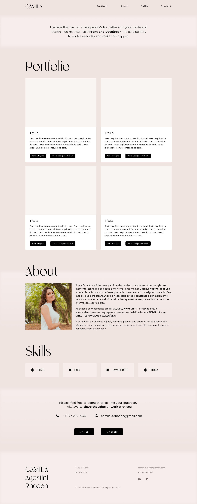

# Portfolio

## Estrutura Básica

O portfolio foi realizado em página única, para ser mais objetivo, e dividido em: Navbar, Hero Header, Seção Portfolio, Seção Sobre, Seção Habilidades, Seção Contato e Footer.

 

## Bootstrap

Para construção deste site foi utilizado o framework Bootstrap para trazer agilidade no desenvolvimento deste portfolio responsivo. O que mais foi utilizado neste projeto foram as divisões em sections, o uso de rows e colums e cards.

 

## Glassmorphism

Foi utilizado glassmorphism com blur nas faixas que compõem o background da Hero Header e das seções Sobre e Contato para auxiliar na divisão das seções de forma visual, criando um efeito de nuvem. A intenção era auxiliar na divisão dos conteúdos, mas integrar ao mesmo tempo.

 

## Estilo

Uma fonte diferente das disponíveis no Google Fonts foi incorporada no projeto por trazer mais a personalidade da identidade visual da autora. Foi escolhido utilizar um fundo simples, e uma Hero Header sem imagem justamente para dar destaque ao conteúdo do portfolio quando o usuário for olhar o site. A seção Contato não conta com título por ser breve e não possuir campo de formulário para envio de mensagem.

Antes de desenvolver o site em Html e CSS, foi feito um Wireframe de alta fidelidade no Figma, como mostra a imagem, e a partir dele o site foi sendo desenvolvido. Foi utilizado CSS externo para deixar o design do site com o layout desejado.

